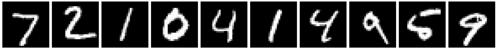

---
jupyter:
  jupytext:
    formats: ipynb,md
    text_representation:
      extension: .md
      format_name: markdown
      format_version: '1.2'
      jupytext_version: 1.6.0
  kernelspec:
    display_name: Python 3
    language: python
    name: python3
---

<!-- #region id="YKqKMhoBO2eF" -->
# ISMRM 2021 Software Demo: 
## Neural Networks in BART

This tutorial uses the [BART](http://mrirecon.github.io/bart/) command-line inteface (CLI) and presents how to train and apply predefined neural networks using BART.

+ **PART I**: Simple example network for MNIST dataset
 1. Prepare dataset
 2. Train a neural network with BART
 3. Evaluate it
 4. Apply it


+ **PART II**: Application of Variational Network and MoDL
 1. Prepare dataset
 2. Apply network

**Authors**: [Moritz Blumenthal](mailto:moritz.blumenthal@med.uni-goettingen.de), [Nick Scholand](mailto:nick.scholand@med.uni-goettingen.de), [Christian Holme](mailto:christian.holme@med.uni-goettingen.de)

**Presenter**: [Moritz Blumenthal](mailto:moritz.blumenthal@med.uni-goettingen.de)

**Institution**: University Medical Center Göttingen
<!-- #endregion -->

<!-- #region id="IH-1tPOa_nME" -->
# Setup Environment (BART + Data)
<!-- #endregion -->

<!-- #region id="FF1pSiWRO2eM" -->
### 0.1a BART on a Local System

If you run this notebook on your local machine, make sure that **TOOLBOX_PATH** points to your BART directory and that your local BART follows the branch **nn_ismrm2021**.

For fast inference and training on the CPU, we recommend to compile with the compile flags:
* `OPENBLAS=1` - to directly link against OpenBLAS and not the system BLAS library
* `BLAS_THREADSAFE=1` - to allow calling BLAS from multiple threads in parallel (which might give race conditions for some BLAS libraries)

Depending on your system, it might be usefull to restrict the number of threads to the number of physical cores by setting `OMP_NUM_THREADS`.
<!-- #endregion -->

```python id="jOpINkR2O2eN" outputId="5d7dfa89-a6df-493d-85d1-aa71a611fda8" colab={"base_uri": "https://localhost:8080/"}
# Set environmental variables for MY LOCAL MACHINE
%env TOOLBOX_PATH=/home/moritz/Bart/bart
%env OMP_NUM_THREADS=4
```

<!-- #region id="UaQk0TTVO2eO" -->
### 0.1b BART on Google Colab

The next cells will setup BART on Google Colab. For a detailed explanation, see the [How to Run BART on Google Colaboratory](https://github.com/mrirecon/bart-workshop/tree/master/ismrm2021).  
Skip this cells if you want to run this notebook on your local machine.

This tutorial does not need a GPU instance, but you can use one:

- Go to Edit → Notebook Settings
- Choose GPU from Hardware Accelerator drop-down menu

<!-- #endregion -->

```bash id="DzWLkUC9PWoW" outputId="eb9ca5a2-f8d0-41f3-9cfe-2951a9396439" colab={"base_uri": "https://localhost:8080/"}

# Use CUDA 10.1 when on Tesla K80

# Estimate GPU Type
GPU_NAME=$(nvidia-smi --query-gpu=gpu_name --format=csv,noheader)

echo "GPU Type:"
echo $GPU_NAME

if [ "Tesla K80" = "$GPU_NAME" ];
then
    echo "GPU type Tesla K80 does not support CUDA 11. Set CUDA to version 10.1."

    # Change default CUDA to version 10.1
    cd /usr/local
    rm cuda
    ln -s cuda-10.1 cuda
else
    echo "Current GPU supports default CUDA-11."
    echo "No further actions are necessary."
fi

echo "GPU Information:"
nvidia-smi --query-gpu=gpu_name,driver_version,memory.total --format=csv
nvcc --version
```

```bash id="fQEVVn59O2eP"

# Install BARTs dependencies
apt-get install -y make gcc libfftw3-dev liblapacke-dev libpng-dev libopenblas-dev &> /dev/null

# Clone Bart
[ -d /content/bart ] && rm -r /content/bart
git clone https://github.com/mrirecon/bart/ bart &> /dev/null

```

```bash id="YiN-TWaf39OB" outputId="43c86d00-123b-4016-f585-aa8dba861e32" colab={"base_uri": "https://localhost:8080/"}

BRANCH=nn_ismrm2021

cd bart

# Switch to desired branch of the BART project
git checkout $BRANCH

# Define specifications 
COMPILE_SPECS=" PARALLEL=1
                CUDA=1
                CUDA_BASE=/usr/local/cuda
                CUDA_LIB=lib64
                OPENBLAS=1
                BLAS_THREADSAFE=1"

printf "%s\n" $COMPILE_SPECS > Makefiles/Makefile.local

make &> /dev/null
```

After downloading and compiling BART, we set the required `TOOLBOX_PATH` variable:

```python id="JPQTTNcg6LFv" outputId="4e9edcf4-d399-4fe8-ffc2-7febf47effc0" colab={"base_uri": "https://localhost:8080/"}
%env TOOLBOX_PATH=/content/bart
```

<!-- #region id="iCwkW7baO2eQ" -->
### 0.2 Set Environment for BART

After downloading and compiling BART, the next step simplifies the handling of BARTs command line interface inside of a ipyhton jupyter-notebook. We add the BART directory to the PATH variable and include the python wrapper for reading *.cfl files:
<!-- #endregion -->

```python id="9WCi0TsVO2eQ"
import os
import sys

os.environ['PATH'] = os.environ['TOOLBOX_PATH'] + ":" + os.environ['PATH']
sys.path.append(os.environ['TOOLBOX_PATH'] + "/python/")

import cfl
import numpy as np

from matplotlib import pyplot as plt
from IPython.display import Image
```

Check BART setup:

```bash

echo "# The BART used in this notebook:"
which bart
echo "# BART version: "
bart version
```

<!-- #region id="1a6cbko5O2eR" -->
### 0.3 Download Data and Weights

Together with this notebook, we provide some testing data and some pretrained weights. To follow this notebook, please download the data and unzip them in the current working directory:
<!-- #endregion -->

```bash id="-CRtl8MpO2eR" outputId="90d6f437-059c-4f80-9135-a86f3060a06f" colab={"base_uri": "https://localhost:8080/"}

# Download the required supporting material if it is not already there
[ ! -f data_weights.zip ] && wget -q https://github.com/mrirecon/bart-workshop/raw/master/ismrm2021/neural_networks/data_weights.zip
unzip -n data_weights.zip
```

<!-- #region id="AC6nG5jHO2eS" -->
# PART I: MNIST-Example

We train a network to map 28x28 images of handwritten digits to the corresponding labels:

$$ Net: (Image, Weights) \mapsto Labels $$ 



### `bart nnet`

To **train**, **evaluate** or **apply** generic neural networks mapping one input tensor to one output tensor, we can use the `bart nnet` command. It creates a non-linear operator representing the network selected by the `--network` option. The command is provided three files, i.e.
* the input;
* the weights;
* the output/reference.

Let us have a look at the help:
<!-- #endregion -->

```bash id="zdpZeM95O2eS" outputId="82cc338b-cf53-4cd5-a107-d91684d4230e" colab={"base_uri": "https://localhost:8080/"}

bart nnet -h
```

```bash id="6NvvwebVO2eT" outputId="0122be21-6a62-418d-e4e9-90da25fe921f" colab={"base_uri": "https://localhost:8080/"}

bart nnet --network h
```

<!-- #region id="MOUvjvZcO2eT" -->
## 1.1 Prepare MNIST Dataset

Before we can train our network, we convert the MNIST dataset to the BART file format, i.e. the images are stored as complex floats. The labels are converted to one-hot encoded \*.cfl file. For this step we provide a short python script, which is called in the next cell.  
In this tutorial, we also extract a smaller dataset based on the first 200 examples from the original MNIST dataset. We prefix the corresponding data with s*.
<!-- #endregion -->

```bash id="KytWuLnUO2eU" outputId="0d7af311-9163-4c58-cc1d-567e79db32c2" colab={"base_uri": "https://localhost:8080/"}

echo "GZ files:"
ls data/*.gz

python convert_mnist.py

bart extract 2 0 200 data/test_images data/stest_images 
bart extract 2 0 200 data/train_images data/strain_images 

bart extract 1 0 200 data/test_labels data/stest_labels
bart extract 1 0 200 data/train_labels data/strain_labels 

echo ""
echo "CFL files:"
ls data/s*.hdr
```

<!-- #region id="KcB9BjQ5O2eV" -->
Let us have a look at the dataset to understand it. The labels are stored one-hot encoded, i.e. for each image a vector of size 10 is provided having a 1 at the index corresponding to the digit in the image:
<!-- #endregion -->

```python id="E6oXSCOWO2eV" outputId="712dd214-48e0-4832-b323-f59f45417f49" colab={"base_uri": "https://localhost:8080/", "height": 471}
!echo "Input Images (data/stest_images):"
!head -n2 data/stest_images.hdr
!echo ""

images = cfl.readcfl("data/stest_images")[:,:,:10]

fig, axs = plt.subplots(1, 10, figsize=(50,5))
for i in range(10):
    axs[i].imshow(np.real(images[:,:,i]), cmap="gray")
    axs[i].set_xticks([])
    axs[i].set_yticks([])
plt.tight_layout()
plt.savefig("mnist_example.png")
plt.show()

!echo ""
!echo "Output Labels (data/stest_labels):"
!head -n2 data/stest_labels.hdr
!echo ""

labels = cfl.readcfl("data/stest_labels")[:,:10]
print(np.real(labels.transpose([1, 0])))

```

<!-- #region id="RHI8WeKdO2eW" -->
## 1.2 Train the MNIST Network

When we train the network, we search for the minium of

$$
Loss(Net(Image, Weights), Labels)
$$

with respect to the weights. When we choose the `--train` option of the `bart nnet` command, we first create a non-linear operator (nlop) representing $Net(Image, Weights)$. This nlop is then chained into an nlop computing the $Loss$.  
To minimize the $Loss$, we use gradient based methods.

For visualization, we can export the nlop as a graph file using the `--export-graph` option:
<!-- #endregion -->

```python id="oD4lxv8CO2eX" outputId="e9a76b07-ef7f-4644-e4b8-8de7da1f4d18" colab={"base_uri": "https://localhost:8080/", "height": 1000}
# This command would create the visualization of the graph:
#!dot -Tpng mnist.dot>mnist_graph.png

# In this presentation we just want to display it
display(Image(filename='mnist_graph.png'))
```

<!-- #region id="KNcqIraUO2eX" -->
Finally, we run the training:
<!-- #endregion -->

```python id="agFvSCa0O2eY" outputId="7ca0b768-3392-474b-8424-a2e6f6a584c4" colab={"base_uri": "https://localhost:8080/"}
!bart nnet \
    --train \
    --network mnist \
    --train-algo epochs=2 \
    --batch-size 20 \
    --export-graph=mnist.dot \
    data/strain_images \
    weights/mnist \
    data/strain_labels
```

<!-- #region id="xb6PWKylO2eY" -->
The weights file contains multiple multi-dimensional arrays:
<!-- #endregion -->

```bash id="sFALOdvdO2eY" outputId="729c1fc3-0ce1-4f0b-f494-f9cd67c14230" colab={"base_uri": "https://localhost:8080/"}

ls weights/mnist.*
echo ""
cat weights/mnist.hdr
```

<!-- #region id="7_dXzYvYO2eZ" -->
## 1.3 Evaluate the MNIST Network

To evaluate the trained network, we apply it and compare the result with the reference using the `--eval` flag:
<!-- #endregion -->

```bash id="bMEriyPQO2eZ" outputId="2fe5f20b-6f42-4db1-ace1-185876f5e831" colab={"base_uri": "https://localhost:8080/"}

bart nnet \
    --eval \
    --network=mnist \
    data/stest_images \
    weights/mnist \
    data/stest_labels
```

<!-- #region id="YPs9IkS-O2ea" -->
For reasonable results, we need to train longer on the full dataset. We provide pretrained weights but you might generate them using:
<!-- #endregion -->

```python id="hWWuF5VIO2ea"
# Train on larger dataset

#!bart nnet --train \
#    --network=mnist \
#    --train-algo epochs=10 \
#    --gpu \
#    data/train_images \
#    weights/weights_pretrained \
#    data/train_labels
```

```bash id="SFT3WKLNO2ea" outputId="354898cc-0284-44fc-dc7a-7cb11e43fcfe" colab={"base_uri": "https://localhost:8080/"}

# Evaluate the network trained on a larger dataset

bart nnet \
    --eval \
    --network mnist \
    data/stest_images \
    weights/mnist_pretrained \
    data/stest_labels
```

<!-- #region id="nCaXweMvO2ea" -->
## 1.4 Apply the MNIST Network

Finally, we can apply the network to predict labels using the `--apply` option.
<!-- #endregion -->

```bash id="PXf9xKG4O2eb"

bart nnet \
    --apply \
    --network=mnist \
    data/stest_images \
    weights/mnist_pretrained \
    mnist_onehot
```

The one-hot encoded output is converted to an integer encoded output with the `onehotenc` tool by taking the entry with the maximum probability.

```bash

bart onehotenc -r \
    mnist_onehot \
    mnist_integer
```

Let us have a look at the results.

```python id="yPc8WRMvO2eb" outputId="dd163750-25db-479e-e008-b6735669a6bd" colab={"base_uri": "https://localhost:8080/", "height": 557}
!echo "Input Images:"
display(Image(filename='mnist_example.png')) 

!echo ""
!echo "#One-Hot Encoding (mnist_onehot.hdr):"
!head -n2 mnist_onehot.hdr
!echo ""

!echo "Probabilities:"

labels = cfl.readcfl("mnist_onehot")[:,:10]
np.set_printoptions(precision=0)
print(np.real(labels.transpose([1, 0])))

!echo ""
!echo "#Integer Encoding (mnist_integer.hdr):"
!head -n2 mnist_integer.hdr

!echo ""
!echo "Predicted Labels:"

labels = cfl.readcfl("mnist_integer")
np.set_printoptions(precision=0)
print(np.real(labels[:,:10]))

```

<!-- #region id="REBOoE7YO2eb" -->
# PART II: Reconstruction Networks - `bart reconet`

We have implemented

> Variational Network<sup>1</sup>:
$$
x^{(i)} = x^{(i-1)}  - \lambda \nabla||Ax -b||^2 + Net(x^{(i-1)}, \Theta^{(i)} )
$$
> MoDL<sup>2</sup>:
$$
\begin{align}
z^{(i)} &= Net\left(x^{(i-1)}, \Theta \right)\\
x^{(i)} &= \mathrm{argmin}_x ||Ax -b||^2 + \lambda ||x - z^{(i)}||^2
\end{align}
$$

>Where
+ $A$ - MRI forward operator $\mathcal{PFC}$
    + $\mathcal{P}$ - Sampling pattern
    + $\mathcal{F}$ - Fourier transform
    + $\mathcal{C}$ - Coil sensitivity maps
+ $b$ - measured k-space data
+ $x^{(i)}$ - reconstruction after $i$ iterations
+ $x^{(0)}=A^Hb$ - initialization
+ $\Theta$ - Weights

>1: Hammernik, K. et al. (2018), [Learning a variational network for reconstruction of accelerated MRI data](https://doi.org/10.1002/mrm.26977). Magn. Reson. Med., 79: 3055-3071.

>2: Aggarwal, H. K. et al.(2019), [MoDL: Model-Based Deep Learning Architecture for Inverse Problems](https://doi.org/10.1109/TMI.2018.2865356). IEEE Trans. Med. Imag., 38(2): 394-405

To **train**, **evaluate** or **apply** unrolled networks, we provide the `bart reconet` command. It follows the same logic as the `bart nnet` command but gets the coil sensitivity maps as an additional input. Let us look at the help:
<!-- #endregion -->

```bash id="xtmtrrdsO2ec" outputId="ab235691-6456-498c-c596-7ee68bed0cd0" colab={"base_uri": "https://localhost:8080/"}

bart reconet -h
```

```bash id="neRgTjhIO2ec" outputId="7b3b7173-ee2b-4eab-a490-38449010c6d8" colab={"base_uri": "https://localhost:8080/"}

bart reconet --network h
```

<!-- #region id="kbsh6dJxO2ed" -->
## 2.1 Prepare the Knee-Data

Here, we use the data provided with the publication of the Variational Network, i.e. the coronal_pd_fs folder of the NYU-Dataset. The data has been converted to the .cfl-file format.  
In the data folder, we find the fully-sampled kspace data of a knee and a sampling pattern. As the kspace is fully sampled, we can define a ground truth reference.

Before we apply the networks, we will create/estimate:
+ the downsampled kspace
+ coil sensitivity maps
+ a ground truth reference
<!-- #endregion -->

```python id="bTyq4N9GO2ed" outputId="5445dc02-86ee-480e-95c4-4d50c3cfbfff" colab={"base_uri": "https://localhost:8080/", "height": 405}
!echo $'\n# K-Space (fully sampled):'
!head -n2 data/kspace_fs.hdr

!echo $'\n# Pattern:'
!head -n2 data/pattern_po_4.hdr

pattern = np.abs(cfl.readcfl("data/pattern_po_4"))
plt.imshow(pattern, cmap="gray")
plt.show()
```

<!-- #region id="Vv8x1C5GO2ed" -->
### 2.1.1 Create Downsampled Kspace

We downsample the fully-sampled kspace by multiplying it with the sampling pattern:
<!-- #endregion -->

```bash id="7LFsYnyhO2ee"

bart fmac data/kspace_fs data/pattern_po_4 kspace
```

<!-- #region id="DY3vjy41O2ee" -->
### 2.1.2 Estimate Coil Sensitivity Maps

We estimate the coil sensitivity maps using ESPIRiT. 
<!-- #endregion -->

```bash id="-XY8FDrvO2ee" outputId="825ef8ca-853e-4bd0-c009-1834101df813" colab={"base_uri": "https://localhost:8080/"}

bart ecalib -r24 -m1 kspace coils_l
bart resize -c 0 320 coils_l coils
```

<!-- #region id="hOqL2XoOO2ee" -->
### 2.1.3 Reconstruction of the Reference

We construct the **ground truth reference** as the coil-combinded reconstruction of the fully-sampled kspace data. For comparison, we also compute a **l1-wavelet** regularized and the **zero-filled** reconstruction.
<!-- #endregion -->

```bash id="mGcZDnJrO2ef" outputId="338dca9f-2de5-414c-b7e1-602203edcf77" colab={"base_uri": "https://localhost:8080/"}

mkdir -p tmp

FFT_FLAG=$(bart bitmask 0 1)
COIL_FLAG=$(bart bitmask 3)

# Reference
bart fft -i -u $FFT_FLAG data/kspace_fs tmp/coil_image
bart fmac -C -s$COIL_FLAG tmp/coil_image coils_l tmp/image

# PICS l1
bart pics -S -l1 -r0.001 -pdata/pattern_po_4 kspace coils_l tmp/pics_reco_l
#resize (frequency oversampling)

# Zero-filled
bart fft -i -u $FFT_FLAG kspace tmp/coil_image_zf
bart fmac -C -s$COIL_FLAG tmp/coil_image_zf coils_l tmp/image_zf_l

#resize (frequency oversampling)
bart resize -c 0 320 tmp/image ref
bart resize -c 0 320 tmp/pics_reco_l pics_reco
bart resize -c 0 320 tmp/image_zf_l zero_filled

rm -r tmp
```

<!-- #region id="icoDWsd-O2ef" -->
We show the results:
<!-- #endregion -->

```python id="5C3Vv_8DO2ef" outputId="29bee6e8-8a60-4fb2-c9c8-ffa82423af29" colab={"base_uri": "https://localhost:8080/", "height": 426}
ref = cfl.readcfl("ref")
pics_reco = cfl.readcfl("pics_reco")
zero_filled = cfl.readcfl("zero_filled")

vmax=0.9*np.max(np.abs(ref))

fig, axes = plt.subplots(figsize=(20,6), nrows=1, ncols=3, sharex=True, sharey=True)

axes[0].imshow(np.abs(ref[::-1,::-1]), cmap="gray", vmax=vmax)
axes[0].set_title("Coil Combined Reference", fontsize=20)

axes[1].imshow(np.abs(pics_reco[::-1,::-1]), cmap="gray", vmax=vmax)
axes[1].set_title("l1-Wavelet Regularized", fontsize=20)

axes[2].imshow(np.abs(zero_filled[::-1,::-1]), cmap="gray", vmax=vmax)
axes[2].set_title("Zero-filled Reconstruction", fontsize=20)

plt.tight_layout()
plt.show()
```

<!-- #region id="-rTVMrN9O2eg" -->
## 2.2 Apply Variational Network

Having prepared the dataset, we can apply the Variational Network using the downloaded weights. The dataset is normalized by the maximum magnitude of the zero-filled reconstruction by using the `--normalize` option.  
We use the pretrained weights provided in the weights directory. They have been trained on the first 15 knees from the coronal_pd_fs directory of the NYU-Dataset

<!-- #endregion -->

```bash id="LXSwhOMmO2eg" outputId="51ff9a8e-566a-4ace-c943-a043e3902095" colab={"base_uri": "https://localhost:8080/"}

#GPU=--gpu; # if BART is compiled with gpu support, we add the --gpu option

bart reconet \
    $GPU \
    --network=varnet \
    --normalize \
    --apply \
    --pattern=data/pattern_po_4 \
    kspace \
    coils \
    weights/varnet \
    varnet
```

<!-- #region id="k0gBuk1bO2eg" -->
We plot the results:
<!-- #endregion -->

```python id="z71Y7RiKO2eg" outputId="6e15af4c-eff5-4f45-c9fb-76a2a378402f" colab={"base_uri": "https://localhost:8080/", "height": 426}
ref = cfl.readcfl("ref")
pics_reco = cfl.readcfl("pics_reco")
varnet = cfl.readcfl("varnet")

vmax=0.9*np.max(np.abs(ref))

fig, axes = plt.subplots(figsize=(20,6), nrows=1, ncols=3, sharex=True, sharey=True)

axes[0].imshow(np.abs(ref[::-1,::-1]), cmap="gray", vmax=vmax)
axes[0].set_title("Coil Combined Reference", fontsize=20)

axes[1].imshow(np.abs(pics_reco[::-1,::-1]), cmap="gray", vmax=vmax)
axes[1].set_title("l1-Wavelet Regularized", fontsize=20)

axes[2].imshow(np.abs(varnet[::-1,::-1]), cmap="gray", vmax=vmax)
axes[2].set_title("Variational Network", fontsize=20)

plt.tight_layout()
plt.show()
```

<!-- #region id="cMhIOphoO2eh" -->
## 2.3 Apply MoDL

Similarly, MoDL can be applied using the provided weights. Here, we unroll 5 iterations.
<!-- #endregion -->

```bash id="OrCx0vFfO2eh" outputId="30b75063-a2a9-4dd5-dd7d-8c44c580142c" colab={"base_uri": "https://localhost:8080/"}

#GPU=--gpu; # if BART is compiled with gpu support, we add the --gpu option

bart reconet \
    $GPU \
    --network=modl \
    --iterations=5 \
    --normalize \
    --apply \
    --pattern=data/pattern_po_4 \
    kspace \
    coils \
    weights/modl \
    modl
```

<!-- #region id="iQnJV0qXO2eh" -->
We plot the results:
<!-- #endregion -->

```python id="C2YMU3i6O2ei" outputId="bc19a930-031c-45e0-e5ba-dd705870d108" colab={"base_uri": "https://localhost:8080/", "height": 459}
ref = cfl.readcfl("ref")
pics_reco = cfl.readcfl("pics_reco")
modl = cfl.readcfl("modl")

vmax=0.9*np.max(np.abs(ref))

fig, axes = plt.subplots(figsize=(20,6), nrows=1, ncols=3, sharex=True, sharey=True)

axes[0].imshow(np.abs(ref[::-1,::-1]), cmap="gray", vmax=vmax)
axes[0].set_title("Coil Combined Reference", fontsize=20)

axes[1].imshow(np.abs(pics_reco[::-1,::-1]), cmap="gray", vmax=vmax)
axes[1].set_title("l1-Wavelet Regularized", fontsize=20)

axes[2].imshow(np.abs(modl[::-1,::-1]), cmap="gray", vmax=vmax)
axes[2].set_title("MoDL", fontsize=20)

plt.tight_layout()
plt.show()
```

<!-- #region id="r30XotMDO2ei" -->
## 2.4 Evaluation of the Variational Network and MoDL
<!-- #endregion -->

```bash id="g5LJkg8eO2ei" outputId="8121e7a3-7794-417b-adbc-c37f81a3d451" colab={"base_uri": "https://localhost:8080/"}

#GPU=--gpu; # if BART is compiled with gpu support, we add the --gpu option

bart reconet \
    $GPU \
    --network=varnet \
    --normalize \
    --eval \
    --pattern=data/pattern_po_4 \
    kspace \
    coils \
    weights/varnet \
    ref 
```

```bash id="OH-x3u6BO2ei" outputId="b7062fc2-5d9e-4d48-b717-7c491c529646" colab={"base_uri": "https://localhost:8080/"}

#GPU=--gpu; # if BART is compiled with gpu support, we add the --gpu option

bart reconet \
    $GPU \
    --network=modl \
    --iterations=5 \
    --normalize \
    --eval \
    --pattern=data/pattern_po_4 \
    kspace \
    coils \
    weights/modl \
    ref 
```

```python id="vfqddC1MO2ej"

```
